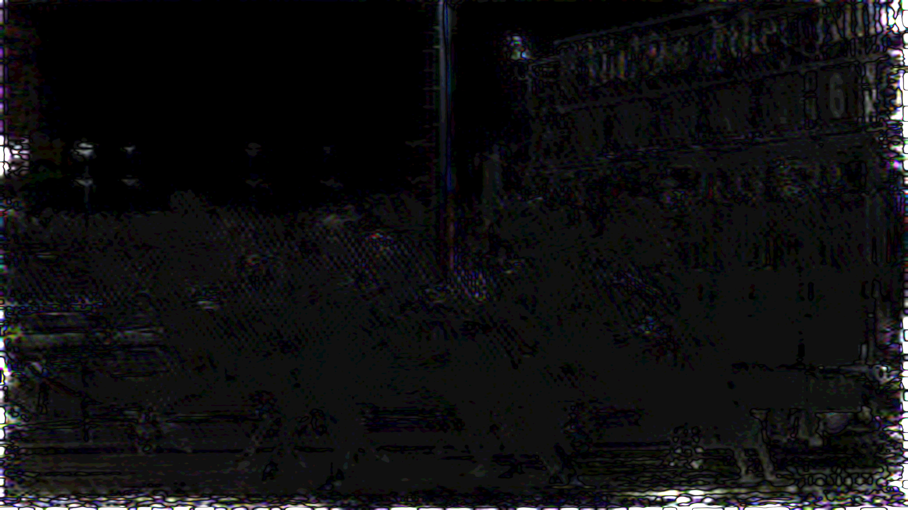
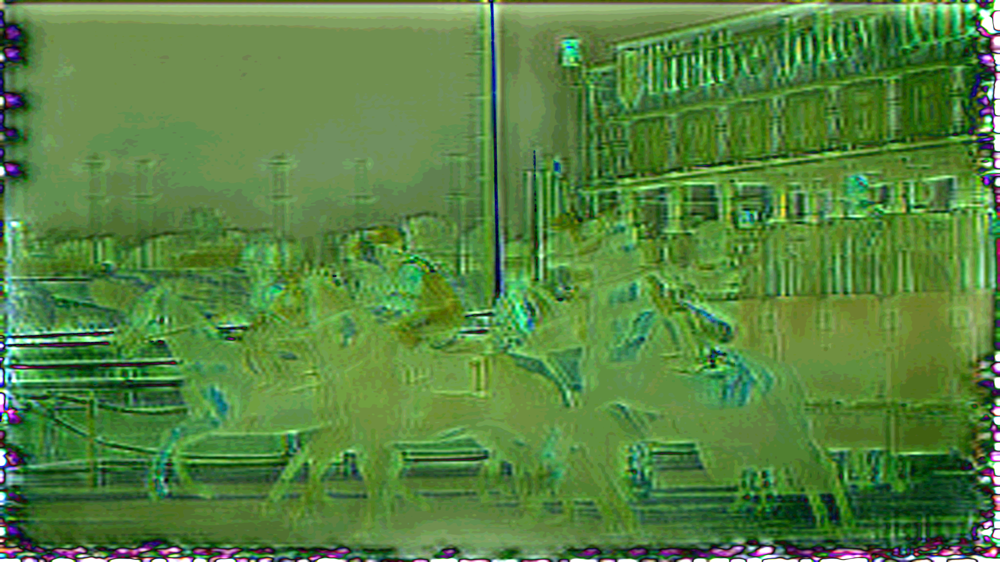

# Video Watermarking with VINE

**Generative Models Project Work** — Università degli Studi di Firenze  
*Professor: Lorenzo Seidenari*

This project extends [VINE](https://github.com/Shilin-LU/VINE), a diffusion-model-based invisible image watermarking system, to full video sequences. It includes a video watermarking pipeline that survives H.264 compression, and fine-tuning experiments to address spatial border artefacts and improve crop robustness.

| VINE-R watermarked frame | VINE-R residual |
|:---:|:---:|
|  |  |

| Fine-tuned watermarked frame | Fine-tuned residual |
|:---:|:---:|
|  |  |

The fine-tuned model (bottom row) distributes the watermark more uniformly, reducing visible border artefacts compared to the base VINE-R model (top row).

---

## Setup

```bash
git clone --recurse-submodules https://github.com/lucacicchese/GM_projectwork_vine_video_watermark.git
cd GM_projectwork_vine_video_watermark
pip install -r requirements.txt
```

FFmpeg must be installed and available on `PATH`.

---

## Usage

### 1. Video watermarking — original VINE-R model

Watermarks a video frame-by-frame using the pretrained VINE-R encoder, re-encodes with H.264, then decodes and reports bit accuracy and quality metrics.

```bash
python main.py \
  --input_video path/to/video.mp4 \
  --watermark_text "VINE2024" \
  --workdir data/video_demo \
  --target_fps 25.0 \
  --crf 23
```

### 2. Video watermarking — fine-tuned model

Same pipeline but uses the fine-tuned encoder/decoder checkpoint. Optionally runs a crop robustness analysis (`--crop_analysis`).

```bash
python main_finetuned.py \
  --input_video path/to/video.mp4 \
  --watermark_text "VINE2024" \
  --checkpoint_dir output/finetune_curriculum/checkpoint-2000 \
  --workdir data/finetune_test \
  --device cuda \
  --crop_analysis
```

### 3. Encode / decode a single image

```bash
# Embed a watermark
python encode_image.py \
  --input path/to/image.png \
  --output path/to/watermarked.png \
  --message "hello" \
  --checkpoint_dir output/finetune/checkpoint-2000 \
  --device cuda

# Recover the message
python decode_image.py \
  --input path/to/watermarked.png \
  --checkpoint_dir output/finetune/checkpoint-2000 \
  --base_decoder Shilin-LU/VINE-B-Dec \
  --device cuda
```

The message is limited to ~12 ASCII characters (100 bits).

### 4. Fine-tuning

Fine-tuning uses the `instructpix2pix-1000-samples` dataset from HuggingFace and the `accelerate` launcher. Training arguments are defined in `vine/src/training_src/training_utils.py`.

```bash
accelerate launch finetune_v2.py
```

Checkpoints are saved to `output/finetune_curriculum/` by default.

---

## Repository structure

```
main.py               # Video pipeline with original VINE-R
main_finetuned.py     # Video pipeline with fine-tuned model
encode_image.py       # Single-image watermark encoding
decode_image.py       # Single-image watermark decoding
finetune_v2.py        # Fine-tuning with edge loss + spread loss + crop augmentation
finetune_original.py  # First fine-tuning attempt (edge loss only)
evaluate.py           # PSNR / SSIM / LPIPS metrics helpers
video_handler.py      # FFmpeg wrappers (extract frames, reassemble, H.264)
watermark_vine_new.py # Multi-chunk VINE-R encoding/decoding helpers
vine/                 # VINE submodule (Shilin-LU/VINE)
assets/               # Comparison images used in the report
```
